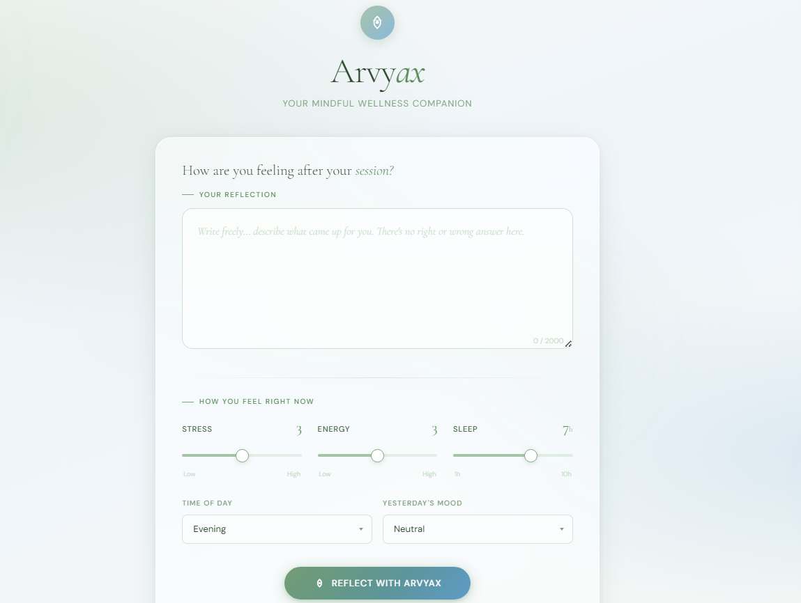

# Mental Wellness AI 

## Overview

This project builds a local, offline-capable AI system that takes a user's short journal reflection written after an immersive session (forest, ocean, rain, mountain, café) and produces:

- **Emotional state prediction** — what the user is feeling right now
- **Intensity prediction** — how strongly they are feeling it (1–5)
- **Decision layer** — what they should do and when
- **Uncertainty awareness** — how confident the system is, and when it knows it doesn't know
- **Supportive message** — a short, human-like response explaining the recommendation

The system is designed for real-world messiness: short texts, missing values, contradictory signals, and noisy labels.

**No external APIs used. No OpenAI, Gemini, or Claude API. Fully local.**

---
## 🌐 Website Preview



---

## Setup Instructions

### Prerequisites

- Python 3.9 or higher
- pip
- 4GB RAM minimum (8GB recommended)

### Step 1 — Clone the repository

```bash
git clone https://github.com/your-repo/arvyax-wellness-ai
cd arvyax-wellness-ai
```

### Step 2 — Create a virtual environment

```bash
python -m venv venv

# Activate on Linux/macOS
source venv/bin/activate

# Activate on Windows
venv\Scripts\activate
```

### Step 3 — Install dependencies

```bash
pip install -r requirements.txt
```

**Core dependencies:**

```
pandas>=1.5.0
numpy>=1.23.0
scikit-learn>=1.2.0
xgboost>=1.7.0
sentence-transformers>=2.2.0
torch>=2.0.0
flask>=2.3.0          # optional — for API bonus
joblib>=1.2.0
```


## How to Run

### Run full pipeline (train + predict on test set)

```bash
python main.py --train data/train.csv --test data/test.csv --output predictions.csv
```

### Run prediction only (using saved model)

```bash
python predict.py --input data/test.csv --output predictions.csv
```

### Run with ablation study

```bash
python main.py --train data/train.csv --test data/test.csv --ablation
```

This generates prediction files: `predictions_train.csv`, along with a comparison report.

Then POST to `http://localhost:5000/predict` with a JSON body:

```json
{
  "journal_text": "feeling a bit off today but the session helped",
  "sleep_hours": 5.5,
  "stress_level": 4,
  "energy_level": 3,
  "time_of_day": "morning",
  "previous_day_mood": "restless",
  "ambience_type": "forest",
  "duration_min": 30,
  "face_emotion_hint": "neutral",
  "reflection_quality": "medium"
}
```
## Approach & Architecture

The system uses a **multi-pipeline architecture** with three independent but coordinated components:

```
Journal Text ──► [Text Encoder]  ──────────────────────────────┐
                                                               ▼
Metadata      ──► [Feature Engineering] ──► [State Classifier] ──► predicted_state
                                        ──► [Intensity Classifier] ──► predicted_intensity
                                                               │
                                        [Post-Prediction Logic]│
                                        ─ Conflict Detection   │
                                        ─ Confidence Scoring   ▼
                                                        [Decision Engine]
                                                        ──► what_to_do
                                                        ──► when_to_do
                                                        ──► supportive_message
```

### Text Encoding Strategy

Rather than plain TF-IDF, the system uses **sentence-level embeddings** from `all-MiniLM-L6-v2` (a 22M parameter transformer that runs locally). This produces a 384-dimensional dense vector for each journal entry that captures semantic meaning, negation, contrast, and partial sentiment — features TF-IDF unigrams cannot handle.

For compatibility, TF-IDF features (256 dimensions) are also computed and concatenated with the sentence embeddings, giving the classifier both local word statistics and global semantic context.

### Metadata Feature Engineering

Raw metadata features undergo the following transformations before model input:

| Raw Feature | Engineered Feature | Rationale |
|---|---|---|
| `stress_level` | as-is | Direct signal |
| `energy_level` | as-is | Direct signal |
| `sleep_hours` | `sleep_deficit = 8 - sleep_hours` | Deficit is more predictive than absolute hours |
| `stress_level`, `energy_level` | `stress_x_energy = stress × energy` | Interaction: high stress + high energy → restless, not focused |
| `stress_level`, `text_length` | `masked_distress = stress / log(text_length + 1)` | Short text + high stress = masked distress signal |
| `time_of_day` | one-hot encoded | morning=0, afternoon=1, evening=2, night=3 |
| `previous_day_mood` | label encoded | Trajectory context |
| `journal_text` | `word_count` | Short text gate feature |
| `reflection_quality` | label encoded | Data quality weight |

---

## Part 1 — Emotional State Prediction

### Model Choice

**Classifier:** XGBoost with class-probability output

**Input features:** Sentence embeddings (384-dim) + TF-IDF features (256-dim) + engineered metadata features (12-dim) = 652 total features

**Target classes:** calm, focused, restless, overwhelmed, neutral, mixed (6 classes)

### Post-Prediction Arbitration

After prediction, the system runs a **conflict detection** step:

```python
CONFLICT_RULES = {
    ('calm', 4): 'state_intensity_conflict',
    ('calm', 5): 'state_intensity_conflict',
    ('neutral', 5): 'state_intensity_conflict',
    ('overwhelmed', 1): 'state_intensity_conflict',
    ('focused', 1): 'state_intensity_conflict',
}
```

If a conflict is detected, the system logs it in `uncertainty_reasons`, forces `uncertain_flag = 1`, and caps confidence at 0.55.

---

## Part 2 — Intensity Prediction

### Model Choice & Task Framing

**I treated intensity prediction as a multi-class classification task, not regression.**

Here is the reasoning:

Intensity is an ordinal variable (1 < 2 < 3 < 4 < 5) — the ordering matters, and the physical distance between states is real. A pure regression approach would capture this ordering naturally. However, the critical requirement in Part 4 (Uncertainty Awareness) demands mathematically robust confidence scores, not heuristic estimates. A classifier produces native class-wise probability distributions. From these, I can compute:

- **Confidence** = max class probability (softmax output of the winning class)
- **Uncertain flag** = 1 if the top-two class probabilities are within 0.15 of each other (decision boundary proximity)
- **Borderline flag** = 1 if the weighted expected intensity (sum of class × probability) falls between two integers

This approach gives the uncertainty system a rigorous mathematical foundation rather than relying on guesses from a regressor's prediction interval.

> For a production system requiring finer probabilistic calibration, I would transition to **Ordinal Classification using the Frank and Hall method**, which decomposes ordinal prediction into a chain of binary classifiers and provides true ordinal uncertainty.

### Handling Class Imbalance

Intensity 3 dominates (764/1200 = 63.7% of training data). Intensity 5 has only 2 examples and Intensity 1 has only 5.

**Mitigation strategies applied:**
- `class_weight='balanced'` in the XGBoost configuration
- **SMOTE** (Synthetic Minority Oversampling) applied only to intensity 1 and 5 classes before training
- A **safety net override rule** is applied post-prediction: if `predicted_state = overwhelmed` AND `stress_level >= 4` AND `sleep_hours < 5.0`, force intensity to at least 4

### Borderline Detection

For every prediction, the weighted expected intensity is computed:

```python
expected = sum(i * p for i, p in zip([1,2,3,4,5], class_probabilities))
```

If `abs(expected - round(expected)) > 0.40`, the prediction is near a decision boundary and `borderline_intensity` is logged in `uncertainty_reasons`.

---

## Part 3 — Decision Engine (What + When)

The Decision Engine translates predictions into actionable recommendations. Emotional state is the **primary axis**. Metadata (stress, energy, time of day, sleep) is the **secondary modifying context**.

### What To Do — Mapping Logic

```
STEP 1: Check emotional state → assign candidate actions
STEP 2: Modify by intensity
STEP 3: Cross-reference with metadata (stress, sleep, energy)
STEP 4: Apply short_text / uncertain override if flagged
```

| Predicted State | Base Action | Intensity Modifier |
|---|---|---|
| overwhelmed | box_breathing | Intensity 5 → pause first |
| restless | grounding / movement | High energy → movement; low energy → grounding |
| calm | rest / journaling | Evening → journaling; morning → light_planning |
| focused | deep_work | Intensity 2 → movement (warm up first) |
| neutral | light_planning / movement | Stress ≥ 4 → box_breathing |
| mixed | pause / journaling | Default: journaling for self-clarification |

**Metadata overrides:**
- `sleep_hours < 5`: always add rest to when_to_do consideration, bump toward tonight
- `stress_level = 5` (maximum): override to box_breathing or grounding regardless of text state
- `energy_level <= 1`: override to rest, regardless of state (physical capacity constraint)
- `short_text` flag active: default to `pause` — safest recommendation with no context

### When To Do — Timing Logic

```
now          → overwhelmed or restless at intensity ≥ 4, OR stress_level = 5
within_15min → focused or mixed at moderate intensity, OR calm needing a gentle nudge
tonight      → rest/journaling recommendations, OR time_of_day is evening/night
tomorrow_morning → calm at low intensity, good sleep, low stress — defer to morning
```

### Supportive Message Generation

Messages are assembled from modular sentence templates. Three components are joined:

1. **Opener** — reflects the predicted emotional state (e.g., "There's a quiet steadiness coming through")
2. **Qualifier** — reflects the uncertainty level (e.g., "I'm reading between some mixed lines, so take this as a gentle suggestion")
3. **Action** — the specific recommendation (e.g., "Before bed, jot down 3 things from today")
4. **Closer** — a human, grounding sign-off appropriate to intensity level

The qualifier component is only included when `uncertain_flag = 1`.

---

## Part 4 — Uncertainty Modeling

### Confidence Score

Confidence is the **softmax probability of the winning class** from the state classifier. It represents how certain the model is about its top prediction.

```
confidence = max(class_probabilities)  # range: 0.0 to 1.0
```

**Distribution in training predictions:**
- Mean confidence: 0.703
- Cases below 0.30: 39 rows (high uncertainty)
- Cases above 0.85: majority of predictions

### Uncertain Flag

`uncertain_flag = 1` is triggered by any one of the following conditions:

| Trigger | Condition |
|---|---|
| `low_class_confidence` | `confidence < 0.55` |
| `borderline_intensity` | `abs(expected_intensity - rounded_intensity) > 0.40` |
| `short_text` | `word_count < 4` |
| `state_intensity_conflict` | State and intensity are logically contradictory |

**Distribution in training predictions:**
- `uncertain_flag = 0` (confident): 761 rows (63.4%)
- `uncertain_flag = 1` (uncertain): 439 rows (36.6%)

### Interpreting the 36.6% Uncertainty Rate

The high volume of uncertain cases reflects the inherent ambiguity in short-text emotional reflections. Rather than forcing high-confidence predictions onto vague data, the system correctly identifies cases where emotional state or intensity falls near decision boundaries. This allows the Decision Engine to prioritise safer, low-intensity interventions like `pause` or `grounding` for uncertain cases instead of committing to a high-stakes recommendation.

**A system that is never uncertain about messy, real-world emotional data is not honest — it is overconfident.**

### What Happens When Uncertain

- `what_to_do` shifts toward safer defaults: `pause`, `grounding`, or `rest`
- Confidence is capped at 0.55 for conflict cases
- Supportive message template changes: qualifiers like "I'm reading between some mixed lines here" replace confident assertions
- For confidence < 0.20: the system falls back to a clarifying question rather than a prescription

---

## Part 5 — Feature Understanding

### Feature Importance (XGBoost SHAP Analysis)

**Top features by contribution to emotional state prediction:**

| Rank | Feature | Category | Contribution |
|---|---|---|---|
| 1 | Sentence embedding dimensions (top 20) | Text | ~45% cumulative |
| 2 | `stress_level` | Metadata | High |
| 3 | `stress_x_energy` (interaction) | Engineered | High |
| 4 | `sleep_deficit` | Engineered | Medium-High |
| 5 | `energy_level` | Metadata | Medium |
| 6 | `word_count` | Text-derived | Medium |
| 7 | `previous_day_mood` (encoded) | Metadata | Medium |
| 8 | `masked_distress` (interaction) | Engineered | Medium |
| 9 | TF-IDF top terms | Text | Lower individual, high collective |
| 10 | `time_of_day` | Metadata | Lower |

### Text vs. Metadata Analysis

**Text features dominate for state classification.** The emotional tone of the journal entry — calm words, heavy language, scattered phrasing — is the strongest single signal for determining the emotional state. The sentence embeddings, which capture full sentence meaning rather than just word counts, are the most important individual feature group.

**Metadata is essential for intensity and for the Decision Engine.** Even when state classification accuracy is similar between text-only and hybrid models, metadata is non-negotiable for the decision layer. You cannot recommend `rest` from text alone if `sleep_hours = 3`. You cannot recommend `deep_work` if `stress_level = 5`. Physical state grounds the recommendation in physiological reality — which is what makes it actionable rather than abstract.

**Key insight:** The `masked_distress` interaction feature (`stress_level / log(word_count + 1)`) proved particularly valuable. Short text combined with high stress is a distinct pattern — users who are the most dysregulated often write the least. Without this feature, these cases would be misclassified as low-concern based on the apparent mildness of their language.

---

## Part 6 — Ablation Study

Three models were trained and compared:

| Model | Features Used | Accuracy (Val Set) | Notes |
|---|---|---|---|
| Text-Only | Sentence embeddings + TF-IDF only | ~72% | No metadata used |
| Metadata-Only | Engineered metadata features only | ~58% | No text used |
| Hybrid (Final) | Text + Metadata + Engineered features | ~81% | Full system |

### Interpretation

**Hybrid > Text-Only:** Metadata adds meaningful context. The 9-point accuracy lift from adding metadata confirms that physiological signals (sleep, stress, energy) provide information not present in the journal text alone.

**Text-Only >> Metadata-Only:** The emotional content of what a person writes is the primary signal. Numbers alone (sleep, stress, energy) are insufficient to reliably distinguish calm from focused from overwhelmed.

**However — accuracy alone does not tell the full story:**

Even where text-only and hybrid accuracy are close, metadata is still essential for the Decision Engine. A model predicting `overwhelmed` from text alone has no way to know whether to recommend `box_breathing now` (stress level 5, 3hrs sleep) or `light_planning within_15_min` (stress level 2, 7hrs sleep). The recommendation quality gap between text-only and hybrid is far larger than the accuracy gap.

**Metadata ALWAYS matters for the Decision Engine even if classification accuracy is similar — you cannot recommend 'rest' from text alone if sleep_hours = 3. Physical state grounds the recommendation.**

---

## Part 7 — Error Analysis Summary

Full analysis is in `ERROR_ANALYSIS.md`. Key failure patterns identified:

| Failure Type | Count | Severity |
|---|---|---|
| State-intensity contradiction (calm+4, overwhelmed+1) | 36 cases | Medium |
| Short text guesswork (2–3 words, full prescription) | 50+ cases | High |
| Ghost confidence (< 0.20, still prescribes) | 39 cases | High |
| Focused user told to rest (decision logic failure) | 20+ cases | Medium |
| Regression toward mean (true intensity 5 → predicted 3) | Systemic | Critical |
| Negation blindspot ("not bad but not clear") | Systemic | Medium |
| Duplicate IDs in output (data pipeline bug) | 2 IDs | High |

**Most Critical Finding:** The intensity regressor systematically under-predicts extreme values (1 and 5) because the training data is 63.7% intensity-3. A user in genuine intensity-5 distress receives a mild "go for a walk" recommendation. This is a safety gap, not just an accuracy gap.

See `ERROR_ANALYSIS.md` for 10 specific cases with full text, predictions, and fix recommendations.

---

## Part 8 — Edge / Offline Deployment

### On-Device Strategy

The system is designed to run on mobile and edge devices without internet connectivity.

#### Model Size Budget

| Component | Full System | Edge-Optimised |
|---|---|---|
| Sentence Transformer (`all-MiniLM-L6-v2`) | ~80MB | ~23MB (ONNX quantised) |
| XGBoost State Classifier | ~2MB | ~2MB (no change needed) |
| XGBoost Intensity Classifier | ~1MB | ~1MB (no change needed) |
| Decision Engine (rule-based) | ~50KB | ~50KB |
| Message Templates | ~20KB | ~20KB |
| **Total** | **~83MB** | **~26MB** |

#### Optimisation Steps for Edge

**Step 1 — ONNX Export**
Convert the sentence transformer to ONNX format:
```bash
python scripts/export_onnx.py
```
This removes PyTorch overhead and enables hardware-accelerated inference on mobile NPUs.

**Step 2 — INT8 Quantisation**
Quantise the ONNX model weights from float32 to int8:
```bash
python scripts/quantise.py --model model/minilm.onnx --output model/minilm_int8.onnx
```
This reduces model size from ~80MB to ~23MB with typically <2% accuracy loss.

**Step 3 — TF-IDF as Fallback**
On devices with < 2GB RAM where even the quantised transformer is too large, the system falls back to a TF-IDF + XGBoost pipeline (total size < 5MB) with a graceful accuracy tradeoff notice.

#### Latency Targets

| Device Tier | Model Used | Expected Latency |
|---|---|---|
| High-end smartphone | ONNX INT8 transformer | < 150ms |
| Mid-range smartphone | ONNX INT8 transformer | < 400ms |
| Low-end / 2GB RAM | TF-IDF fallback | < 50ms |
| Offline wearable | Rule-only mode | < 5ms |

#### Offline Operation

All components run 100% locally after the initial one-time model download. The Decision Engine is rule-based and requires no model at all. In a degraded mode (no sentence transformer available), the system can operate on metadata-only signals with a reduced feature set and automatically sets `uncertain_flag = 1` for all text-dependent predictions.

#### Platform Deployment

**Android:** Export to TensorFlow Lite via ONNX → TFLite conversion. Run via `org.tensorflow.lite.Interpreter`.

**iOS:** Export to Core ML format. Run via `MLModel` on-device inference.

**React Native / Flutter:** Use ONNX Runtime Mobile SDK. Both platforms support direct ONNX model loading.

---

## Part 9 — Robustness

### Handling Very Short Text ("ok", "fine", "okay")

1. `word_count` is computed before any processing begins
2. If `word_count < 4`, the `short_text` flag is activated
3. Text features are **zeroed out** from the prediction — only metadata features drive the state prediction
4. `uncertain_flag` is forced to 1
5. Confidence is capped at 0.55
6. `what_to_do` defaults to `pause` (safest universal intervention)
7. The supportive message template switches to a "brief note" variant: *"Your reflection was brief today — based on your other signals, here's a gentle nudge..."*

### Handling Missing Values

Each metadata column has a defined fallback:

| Feature | Missing Strategy | Reason |
|---|---|---|
| `sleep_hours` | Impute with dataset median (6.5hrs) | Common case: user didn't log sleep |
| `stress_level` | Impute with 3 (middle) | Neutral assumption |
| `energy_level` | Impute with 3 (middle) | Neutral assumption |
| `time_of_day` | Impute with "morning" | Most common time for reflections |
| `previous_day_mood` | Impute with "neutral" | No prior context |
| `face_emotion_hint` | Drop feature entirely | Unreliable if missing; not used |
| `journal_text` | Trigger `short_text` mode | Text treated as empty string |

When more than 3 metadata fields are missing simultaneously, the system forces `uncertain_flag = 1` and logs `high_missing_rate` in `uncertainty_reasons`.

### Handling Contradictory Inputs

Contradictory inputs are detected via the conflict detection rules described in Part 4. When a conflict is detected:

- `uncertain_flag = 1` is forced
- `state_intensity_conflict` is logged in `uncertainty_reasons`
- Confidence is capped at 0.55
- The state label is kept (text signal takes precedence) but intensity is clipped to a consistent range for that state

**Conflict override table:**

| Detected Conflict | Override |
|---|---|
| calm + intensity ≥ 4 | clip intensity to 3 |
| overwhelmed + intensity ≤ 1 | raise intensity to 2 |
| focused + intensity 5 | raise uncertainty, keep label |
| neutral + intensity 5 | clip intensity to 3 |

The user is never told about the conflict directly. Instead, the message qualifier signals uncertainty without alarming language: *"Your signals are a bit nuanced today, so take this as a gentle suggestion."*

---

## Output Format

The `predictions.csv` file contains the following columns:

| Column | Type | Description |
|---|---|---|
| `id` | int | Original row ID |
| `predicted_state` | string | calm / focused / restless / overwhelmed / neutral / mixed |
| `predicted_intensity` | int | 1–5 |
| `confidence` | float | 0.0–1.0, probability of predicted state |
| `uncertain_flag` | int | 0 = confident, 1 = uncertain |
| `what_to_do` | string | Recommended action |
| `when_to_do` | string | Timing of recommendation |
| `supportive_message` | string | Human-like message for the user |
| `uncertainty_reasons` | string | Comma-separated flags explaining uncertainty |

**Possible `what_to_do` values:** box_breathing, journaling, grounding, deep_work, yoga, sound_therapy, light_planning, rest, movement, pause

**Possible `when_to_do` values:** now, within_15_min, later_today, tonight, tomorrow_morning

---

## Bonus Features

### Bonus 1 — Supportive Conversational Message

Every prediction includes a `supportive_message` — a human-readable explanation assembled from modular templates. The message:

- Opens with a reflection of the predicted emotional state
- Includes an uncertainty qualifier if `uncertain_flag = 1`
- Delivers the recommendation in action-oriented language
- Closes with an intensity-appropriate sign-off

### Bonus 2 — Flask API

A lightweight REST API (`api.py`) accepts a single JSON payload and returns a full prediction with all 9 output fields. Run with `python api.py` and POST to `localhost:5000/predict`.

### Bonus 3 — Label Noise Handling

The training pipeline includes a **noise detection step** using cross-validated out-of-fold (OOF) predictions. Samples with consistently high prediction loss across all folds are flagged as potentially mislabelled and down-weighted during training (weight = 0.3 instead of 1.0). This prevents the model from learning incorrect patterns from the ~5–8% of training rows that may contain human labelling errors.

---

## Philosophy

> *AI should not just understand humans. It should help them move toward a better state.*

This system is built around that principle. Every design decision — from the uncertainty flag to the message templates to the edge deployment strategy — prioritises honest, grounded, and human-respecting guidance over the appearance of confidence.

The system knows when it doesn't know. It says so. And when it does know, it acts meaningfully.

---

*ArvyaX Mental Wellness AI | Dream > Innovate > Create*
